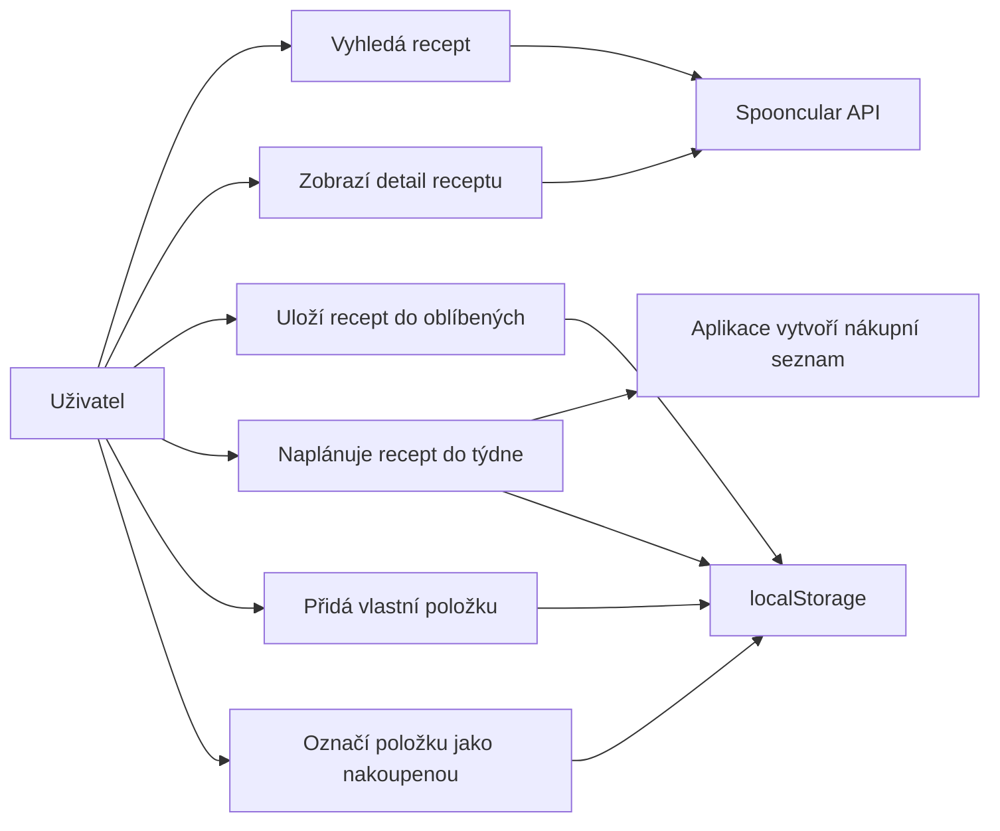

# JidloPlan

JidloPlan je webová PWA aplikace v JavaScriptu pro vyhledávání receptů, tvorbu týdenního jídelníčku a automatické sestavení nákupního seznamu.

## Účel aplikace

Aplikace řeší běžnou situaci: uživatel chce najít inspiraci na jídlo, uložit si zajímavé recepty, rozvrhnout je do týdne a rychle zjistit, co má nakoupit.

## Funkce

- vyhledávání receptů podle názvu,
- filtrování podle kategorií,
- načtení náhodného receptu,
- detail receptu včetně ingrediencí a postupu,
- ukládání oblíbených receptů do `localStorage`,
- týdenní plán jídel pro snídani, oběd a večeři,
- automatický nákupní seznam z naplánovaných receptů,
- ruční přidání vlastních položek do nákupního seznamu,
- označení položek jako nakoupených,
- PWA manifest a service worker.

## Lokální ukládání

Aplikace ukládá data do prohlížeče pomocí `localStorage`.

| Klíč | Obsah |
| --- | --- |
| `jidlplan:favorites` | Oblíbené recepty |
| `jidlplan:weekly-plan` | Týdenní plán jídel |
| `jidlplan:custom-shopping` | Ručně přidané položky nákupního seznamu |
| `jidlplan:checked-shopping` | Stav zaškrtnutých položek |

## Princip fungování

Uživatel může vyhledávat recepty, zobrazit detail receptu a přidat ho mezi oblíbené nebo do týdenního plánu. Při přidání receptu do plánu se z jeho ingrediencí automaticky vytvoří nákupní seznam. Oblíbené recepty, plán i nákupní seznam se průběžně ukládají do `localStorage`.

## Use-case diagram

