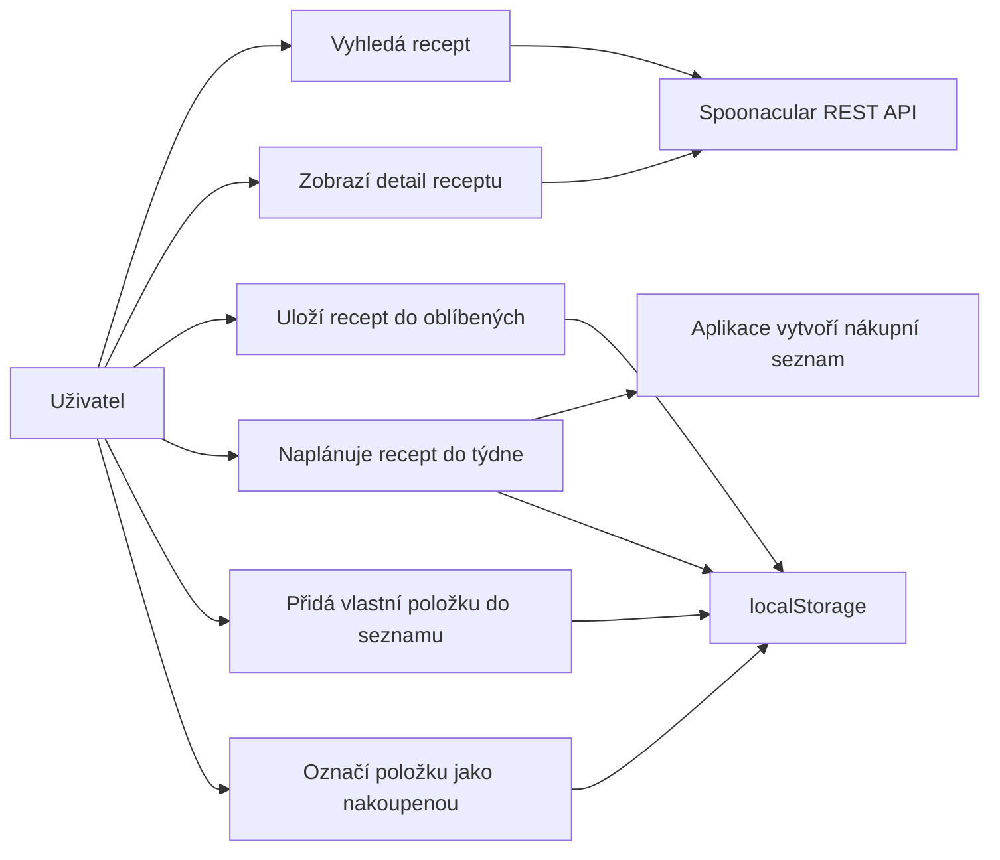

# JidloPlan

JidloPlan je webová PWA aplikace v JavaScriptu pro vyhledávání receptů, tvorbu týdenního jídelníčku a automatické sestavení nákupního seznamu.

## Účel aplikace

Aplikace řeší běžnou situaci: uživatel chce najít inspiraci na jídlo, uložit si zajímavé recepty, rozvrhnout je do týdne a rychle zjistit, co má nakoupit.
## Funkce

- vyhledávání receptů podle názvu,
- filtrování podle kuchyně (italská, japonská, mexická…),
- načtení náhodného receptu,
- detail receptu včetně ingrediencí a postupu,
- ukládání oblíbených receptů do `localStorage`,
- týdenní plán jídel pro snídani, oběd a večeři,
- automatický nákupní seznam z naplánovaných receptů,
- ruční přidání vlastních položek do nákupního seznamu,
- označení položek jako nakoupených,
- záložní lokální recepty při výpadku API,

## Použité API endpointy

Základní URL API: `https://api.spoonacular.com`

| Endpoint | Účel |
| --- | --- |
| `/recipes/complexSearch?query={query}&addRecipeInformation=true` | Vyhledání receptů podle textu, vrátí rovnou plné informace |
| `/recipes/complexSearch?cuisine={cuisine}&addRecipeInformation=true` | Filtrování receptů podle kuchyně |
| `/recipes/random?number=12` | Načtení náhodných receptů |
| `/recipes/{id}/information` | Načtení detailu konkrétního receptu podle ID |

## Lokální ukládání

Aplikace ukládá data do prohlížeče pomocí `localStorage`.

| Klíč | Obsah |
| --- | --- |
| `jidlplan:favorites` | Oblíbené recepty |
| `jidlplan:weekly-plan` | Týdenní plán jídel |
| `jidlplan:custom-shopping` | Ručně přidané položky nákupního seznamu |
| `jidlplan:checked-shopping` | Stav zaškrtnutých položek |

## Struktura projektu

| Soubor | Popis |
| --- | --- |
| `index.html` | HTML struktura aplikace |
| `styles.css` | Responzivní vzhled aplikace |
| `app.js` | Veškerá JavaScript logika aplikace |
| `manifest.json` | PWA manifest (název, ikona, barvy) |
| `sw.js` | Service worker – cache základních souborů pro offline režim |
| `assets/icon.svg` | Ikona aplikace |
| `zadani.md` | Schválené zadání projektu |

## Princip fungování jednotlivých částí

## Princip fungování jednotlivých částí
 
### Komunikace s API
 
Funkce `apiGet(endpoint)` sestaví URL, nastaví časový limit 8 sekund přes `AbortController` a zavolá `fetch()`. Při chybě se zobrazí záložní lokální recepty. Funkce `normalizeMeal()` převede odpověď Spoonacular na interní strukturu kterou používá zbytek aplikace.
 
### Dynamická úprava obsahu stránky
 
Aplikace nemá žádný framework – DOM mění přímo JavaScript. Funkce jako `renderRecipes()`, `renderPlanner()` a `renderShoppingList()` vždy celou sekci přepíší znovu podle aktuálního stavu v objektu `state`.
 
### localStorage
 
Funkce `saveStorage()` uloží data jako JSON, `loadStorage()` je při spuštění načte zpět. Data se ukládají okamžitě po každé změně.
 
### Týdenní plán
 
Plán je objekt kde klíčem je den a hodnotou tři sloty (`breakfast`, `lunch`, `dinner`). Každý slot je buď `null` nebo objekt receptu. Po každé změně plánu se automaticky přegeneruje nákupní seznam.
 
### Nákupní seznam
 
Funkce `collectPlannedIngredients()` projde celý plán a sesbírá ingredience. Duplicity odstraní `Set`, výsledek se seřadí abecedně. Ručně přidané položky a zaškrtnuté stavy se ukládají zvlášť do `localStorage`.
 
### PWA
 
`manifest.json` definuje název, ikonu a režim `standalone`. Service worker při první návštěvě uloží základní soubory do cache – aplikace pak funguje i offline. API volání se necachují, při výpadku internetu se zobrazí záložní recepty.
## Use-case diagram

